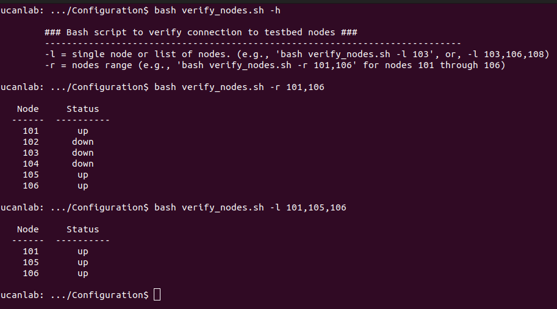
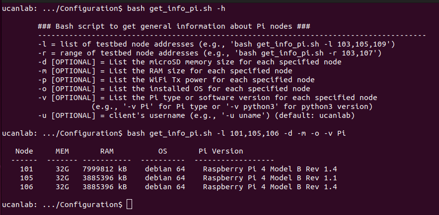

# Control Network Configuration
## Overview
Before running performance analysis tests on the wireless network, we will first configure the control network and verify that the network conventions are setup appropriately. The process for this configuration is as follows:
* [Network Setup](https://github.com/UCaNLabUMB/Testbed_Controller/blob/main/Documentation/Config_Control_Net.md#control-network-setup)
  - Connect Control Network Hardware
  - Verify Network Connections using the `verify_nodes.sh` Testbed Script
* [Setup passwordless SSH between TC and RPi Nodes](https://github.com/UCaNLabUMB/Testbed_Controller/blob/main/Documentation/Config_Control_Net.md#setup-passwordless-ssh)
* [Verify SSH Connections using the `get_info_pi.sh` Testbed Script](https://github.com/UCaNLabUMB/Testbed_Controller/blob/main/Documentation/Config_Control_Net.md#verify-ssh-configuration)
* [Complete Setup/Installation of Testbed Software on RPi Nodes](https://github.com/UCaNLabUMB/Testbed_Controller/blob/main/Documentation/Config_Control_Net.md#install-testbed-software-on-rpi-nodes)
* [Setup VNC Viewer](https://github.com/UCaNLabUMB/Testbed_Controller/blob/main/Documentation/Config_Control_Net.md#setup-vnc-viewer-optional) (Optional)

**NOTE:** Once the hardware connection is complete, you should be able to complete all remaining tasks from the TC.

## Control Network Setup

### Hardware Connection
The physical connection for the control network can be implemented in any way that links the TC and all RPi nodes on the same network. For simplicity, you can use a network switch (or a set of switches) to connect all devices, as shown below. Make sure that each device is connected to the switch(es) using the network interface that was setup with a static IP on the `10.1.1.X` subnet.

_Image Coming Soon_

### Network Verification
We will first confirm that the TC can communicate with all devices on our local access network (LAN). To do this, we use the testbed's `verify_nodes.sh` script that should be in your local testbed repository. We have already seen this script briefly when ensuring that the testbed code was installed, but we will now use the script to verify that the TC can communicate with all RPi nodes. The help option, `bash verify_nodes.sh -h`, shows the two flags that we can use for this script. This convention is common across most scripts that we use for the testbed.
* `-l`: This flag parameter allows the user to indicate a comma separated list of nodes that we should verify. For example, if we wanted to check the addresses 10.1.1.101, 10.1.1.104, and 10.1.1.107 we would use the command `bash verify_nodes.sh -l 101,104,107`.
* `-r`: This flag parameter allows the user to input a range of nodes to be verified. For example, if we had 10 devices, ranging from 10.1.1.101 to 10.1.1.110, we would use the command `bash verify_nodes.sh -r 101,110`.

When this script is run, it pings each requested node and determines if the TC receives a response. The example below shows an instance where we first request the help menu, and then use the script to check the status of nodes 101 through 106. In this case, we do not have nodes 102 through 104 connected. Accordingly, the script indicates that 101, 105, and 106 are "up" and the other nodes are "down" (i.e., the TC can not communicate with them). We then use the list flag so that only the connected devices are checked.

## Setup Passwordless SSH
In order to establish a trusted passwordless connection between the TC and the RPi nodes, we use the secure shell (SSH) protocol. In this setup stage, we establish the association between the TC and all RPi nodes. Once established, the TC will be able to communicate with and control the RPi nodes more freely, and we will be able to execute the other testbed scripts. 

To setup passwordless SSH, you should first generate a public/private key pair. In a terminal on the TC, you can do this with the `ssh-keygen` command. When generating the key, you will be asked for the file to save the key in and a passphrase for the key. You can press enter through each of these options to use defaults (i.e., no passphrase and store the key in the directory `~/.ssh/id_ed25519` where ~ represents your home directory). After the key is generated at the TC, it needs to be shared with the RPi nodes. This is done with the `ssh-copy-id` command, which can be run with the command `ssh-copy-id -i ~/.ssh/id_ed25519 <pi address>` where `<pi address>` represents the username and IP address for the specific node to be configured. When copying to the RPi node, you will need to select "yes" to connect and you will need to enter the RPi nodes password one last time (this is whatever password you set when creating the RPi node's microSD card). 

The code below is an example for configuring passwordless SSH for the 3 nodes verified in the image above. Note that the key only needs to be generated once, but should be copied to ALL of the RPi nodes in your testbed. Also, note that we have specified `ucanlab` as the username when setting up our RPi nodes, but this should be replaced with whatever you have indicated for the username on the nodes in your testbed.
* `ssh-keygen`
* `ssh-copy-id -i ~/.ssh/id_ed25519 ucanlab@10.1.1.101`
* `ssh-copy-id -i ~/.ssh/id_ed25519 ucanlab@10.1.1.105`
* `ssh-copy-id -i ~/.ssh/id_ed25519 ucanlab@10.1.1.106`

## Verify SSH Configuration
If the passwordless ssh setup is successful, you should now be able to use the majority of the other testbed scripts to interact with the RPi nodes in your testbed. To verify that everything is setup correctly, we can test using the `get_info_pi.sh` script. This script has a set of optional flags related to potential information of interest for each node, and allows for users to easily aggregate the information about all nodes. We also note that the `-u` flag has been included so that you can specify the username you have set for your clients. By default, this is set to ucanlab. You can also modify the bash script(s) directly and set the default username to the username that you have assigned for your RPi nodes (if you want to avoid the need to use the `-u` flag in your commands).

The instance below shows how we have used the script to determine our nodes' microSD card memory, available RAM, installed OS, and hardware information. If this information is displayed for all of the nodes in your system without any errors (and without requiring that you enter a password), then the passwordless SSH is setup and you are almost ready to start testing!

## Install Testbed Software on RPi Nodes
In this step, we use the testbed's `setup_pis.sh` script to create the necessary directory structure on the RPi nodes, and to copy over some scripts that will eventually be run on the RPi nodes. This is done to provide autonomy of the nodes, allowing the TC to send a command to run a script rather that having the TC send the script's funcionality step-by-step via SSH. This script has the conventional `-l` and `-r` flags used in the testbed. For instance, we use the following command for the three node example:
* `bash setup_pis.sh -l 101,105,106`

**NOTE:** The `setup_pis.sh` script also includes a `-c` flag that clears the testbed directory on the RPi nodes. This is helpful if you have collected data from multiple experiments and you've already aggregated the data at the TC. We intentionally leave local copies of collected data on the RPi nodes so that they can be pulled again in the future if needed, but you can always use the clear flag with `setup_pis.sh` if you want to remove all stored data on the RPi nodes.

## Setup VNC Viewer (Optional)
One of the reasons for using the Desktop version of Pi OS (rather than the "Lite" option) is for simplification of the debugging process when needed. To take full advantage of this, we can setup VNC viewer so that the desktop view of each RPi node can be directly viewed at the TC (rather than being restricted to command line control). To setup VNC viewer, we first enable the VNC server **on each of the RPi nodes**. To do this from the TC, you can follow these steps:
* ssh into the RPi node (e.g., `ssh ucanlab@10.1.1.101` for node 101 in our testbed)
* type `sudo raspi-config` to bring up a configuration menu for the Pi
* Select "Interface Options" and then select "VNC Option" and then select "Yes" 
  - The raspi-config menu will disappear momentarily. Once it comes back it will tell you that VNC Server has been enabled. Select OK, and then scroll right to select "Finish" and close the raspi-config menu.
* In the terminal, type `sudo reboot` to reboot the Pi and start the VNC server.
  - Make sure that you are still seeing the Pi's terminal before entering the reboot command! 
  - If you have already closed the SSH connection, `sudo reboot` will reboot the TC.

After VNC is enabled on the RPi nodes, you can install the viewer on the TC. You can find the VNC Viewer software at the link below. If running Ubuntu Linux on your TC, you can download the .deb file.
* Download from [www.realvnc.com/en/connect/download/viewer](www.realvnc.com/en/connect/download/viewer)
* After downloading the `.deb` file, you can open the _GDebi package installer_ that was installed for the [GitHub Desktop installation](https://github.com/UCaNLabUMB/Testbed_Controller/blob/main/Documentation/Setup_TC.md#testbed-code-setup).
  - Select File->Open and search for the VNC Viewer .deb file that was just downloaded
  - Select "Install" and wait until the installation completes
* Open VNC Viewer and select "Use VNC Viewer without signing in" 
* For each RPi Node, enter the node's IP address (e.g., `10.1.1.101`) in the search menu.
  - When connecting for the first time, you be asked to verify and enter the Pi's username/password. If you select "Remember Password" on this menu, you will be able to open VNC Viewer in the future and quickly view the RPi node's desktop by double clicking on the saved setting.

_Image Coming Soon_

## Previous Chapter
[Setting Up RPi Nodes](https://github.com/UCaNLabUMB/Testbed_Controller/blob/main/Documentation/Setup_RPi_Node.md)

## Next Chapter
[Test Network Configuration](https://github.com/UCaNLabUMB/Testbed_Controller/blob/main/Documentation/Config_Test_Net.md)
