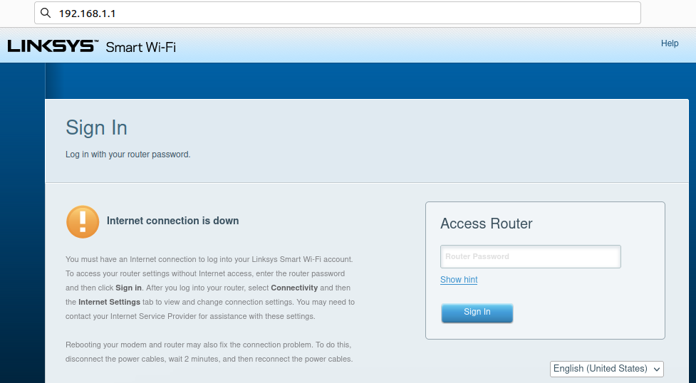
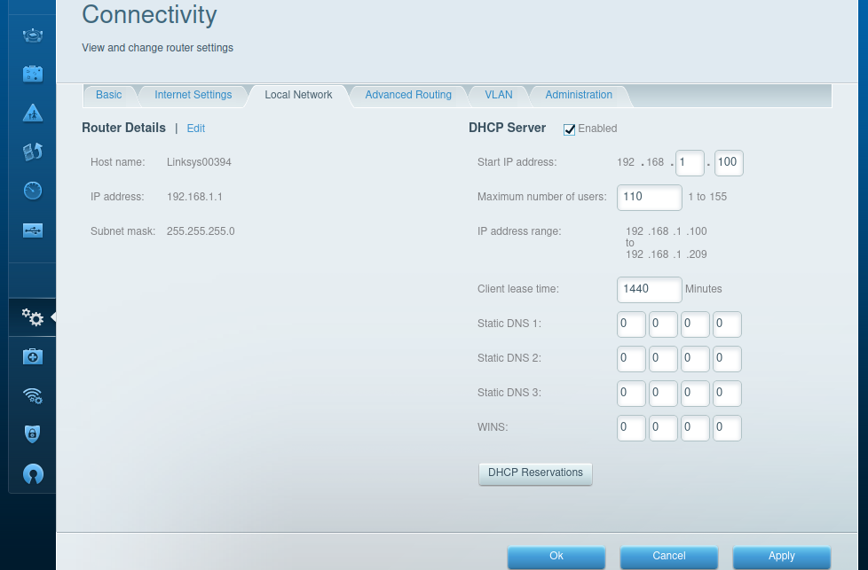
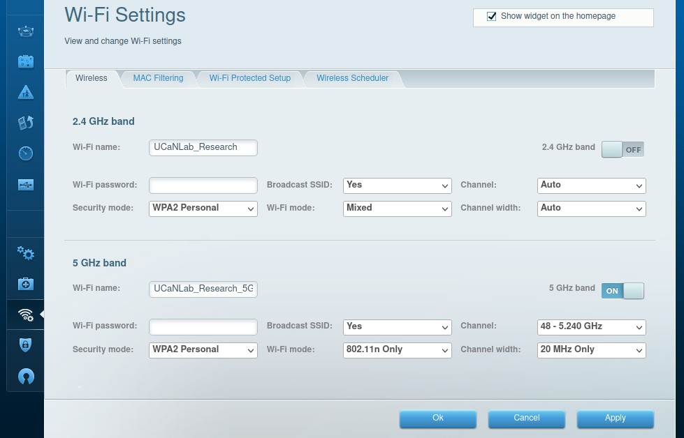
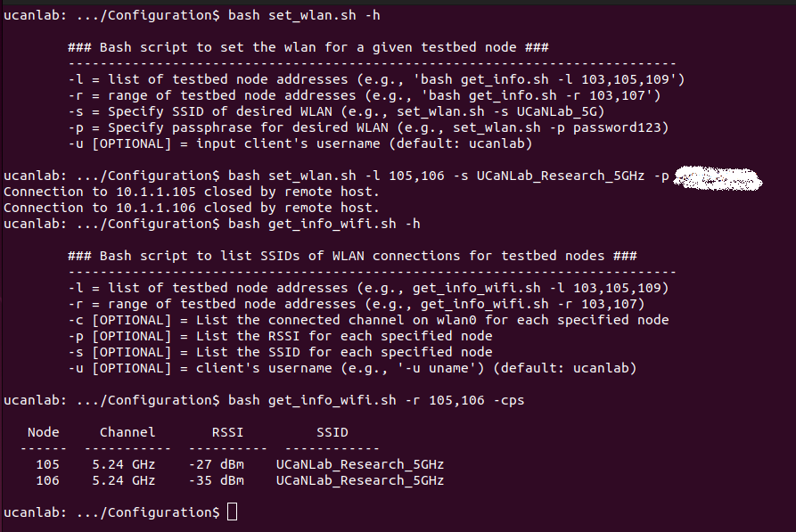

# Test Network Configuration
## Overview
Once the control network is configured, you will need to setup the WiFi AP(s) and WiFi connections to form the test network that you are interested in evaluating. This could consist of mulitple devices connected to a single AP, or devices connected to multiple APs (this is relevant, for example, if you are interested in observing co-channel interference effects). Either way, the Control Network remains as described in the previous section, and the majority of the Test Network configuration can be done directly from the TC. Once the APs and iperf server nodes are configured, you can reconfigure the client network connections to analyze a variety of test scenerios directly from the TC.

In this section, we will discuss the following topics:
* [Setup Access Points (APs)](https://github.com/UCaNLabUMB/Testbed_Controller/blob/main/Documentation/Config_Test_Net.md#setup-aps)
* [Setup Server Node(s)](https://github.com/UCaNLabUMB/Testbed_Controller/blob/main/Documentation/Config_Test_Net.md#server-node-setup)
* [Client Node WiFi Setup](https://github.com/UCaNLabUMB/Testbed_Controller/blob/main/Documentation/Config_Test_Net.md#client-node-wifi-setup)
* [Configure DHCP Reservations](https://github.com/UCaNLabUMB/Testbed_Controller/blob/main/Documentation/Config_Test_Net.md#configure-dhcp-reservations)
* [Verify Test Network Settings](https://github.com/UCaNLabUMB/Testbed_Controller/blob/main/Documentation/Config_Test_Net.md#verify-test-network-settings)

## Setup APs
The main goal here is to configure your AP(s) to align with the testbed conventions, but we will also discuss optional settings that will ensure a somewhat controlled environment for testing. Note that _APs do not need to be connected to the Internet_ for the purpose of this testbed! In fact, in most cases it is preferable if your APs are NOT connected to the Internet (to assure that other traffic is not active on the test network, which would impact your performance analysis).

If you have not configured a router before, the first step is to connect to the router (either wirelessly or via Ethernet) and find the router's configuration page. In most cases, this can be accessed through a web browser by typing `192.168.1.1` in the address bar, but this may differ for various routers (or if the router has already been configured as a different subnet). Once you access the configuration page, you will need to enter the router's password to login. 
* **NOTE:** If you are using the TC to connect to the router, keep in mind that your wired interface has been assigned a static IP and will not be able to communicate with the router! This is also true if you are attempting to connect an RPi node to the router using the Ethernet interface that was assigned a static IP.

Once you have logged into the router, there are some LAN settings that need to be configured for the testbed, and some WiFi settings that can be configured for whatever test you are running. The description for setting these parameters is described below for a **LinkSYS WRT3200ACM** router, but the parameter options should be similar for whatever router you are using.

After logging in, we start by selecting "Connectivity" and going the Local Network tab in order to configure the LAN parameters as follows:
* **Router's IP address/Subnet mask:** The Subnet mask should be 255.255.255.0 and the IP address should be `192.168.Y.1` where Y is unique for each AP in your testbed (e.g., 192.168.1.1, 192.168.2.1, and 192.168.3.1 if you are using three APs in your test environment).
* **DHCP Server:** Modify the DHCP Server Settings to make sure that the DHCP server can allocate device addresses from `192.168.Y.100` through `192.168.Y.201`. This is to account for the iperf clients (starting at `192.168.Y.101`) and the server (at `192.168.Y.201`). In our router's configuration settings (shown below) this is done by setting the start address as `192.168.Y.100` and maximum DHCP users to a number greater than 101.

After applying the changes above, you can optionally edit your Router's WiFi settings.
* **SSID/Password:** You should set the SSID and password to something that you can easily remember for connecting RPi nodes as clients.
* **Channel/Channel Width:** For experimental control, it is best to set a fixed channel that you know is not utilized (this is more easily done in the 5GHz band). Similarly, fixing the channel width can improve the control over your tests to avoid performance effects related to the AP dynamically adapting the channel width (as is done if channel width is set to Auto).
* **WiFi Mode:** To avoid some variability, it can be helpful to clearly specify the WiFi mode.

## Server Node Setup
While most of the RPi nodes will connect via WiFi and operate as iperf clients, a subset of the RPi nodes should be used as iperf servers. The servers nodes should not generate unnecessary traffic on the wireless network, so they should be wired to the AP(s) via Ethernet. Specifically, we connect at least one RPi node to each AP via Ethernet. Since the RPi nodes already have Static IP addresses assigned for their Ethernet interface, you will need a second Ethernet interface on the node(s) that are connecting to the AP(s). For this, you can use a USB to Ethernet adapter. 

When connected, the AP's DHCP server will give the adapter's Ethernet interface a random IP address from the DHCP address range. This will be addressed shortly when configuring the DHCP reservations. This will also imply three network connections for the RPi nodes operating as servers (i.e., the control network via `eth0`, the wired connection to the Test Network via `eth1`, and the wireless connection via wlan0. To avoid potential issues, it is best to disable the WLAN at the server nodes. If you setup VNC Viewer, this is easily done by opening VNC Viewer, connecting to the server node, and then clicking on the network connection (top right corner of the desktop) and selecting "Turn off WLAN"
* **NOTE:** The WLAN can also be disabled via command line, but this is a simple case to demonstrate the use of the VNC Viewer!

## Client Node WiFi Setup
Once the AP(s) and server nodes are configured, the remaining RPi nodes can be connected to the desired WLANs from the TC. To do this easily, the testbed includes a `set_wlan.sh` script in the configuration directory. This script can be used with the `-l` or `-r` flags to indicate a set of nodes to connect. It also has flags for specifying the SSID of the desired WLAN, and for indicating the password of the WLAN. For example, the command below will attempt to connect nodes 105 and 106 to the AP with SSID "mySSID" and password "myPassword".
* `bash set_wlan.sh -r 105,106 -s mySSID -p myPassword`

When this script is run on the TC, it tells each RPi node to call a local script that has been stored in the RPi node's testbed directory during the setup process. The local script updates the wireless network configuration so that it connects to the specified WLAN. After calling executing the script, the RPi node(s) will reboot (causing the warning `Connection to 10.1.1.X closed by remote host.` to appear in the TC's terminal). The figure below highlights an instance where we first check the help menu for `set_wlan.sh` and then use the script to connect nodes 105 and 106 to our AP with SSID "UCaNLab_Research_5GHz". It then shows that we can use the `get_info_wifi.sh` script to verify that the nodes have been connected to the correct WLAN, while also displaying the channel in use for this WLAN and the RSSI at each RPi node.

## Configure DHCP Reservations
In the design of the testbed, the Test Network IP address for each of the client nodes should be set to `192.168.Y.X` where Y represents the AP that the node is connected to and X represents the node's assigned number. We look to reconfigure the Test Network for a variety of scenarios where client nodes may change AP from scenario to scenario, therefore we want the nodes' Test Network IP addresses to be dynamically set in order to maintain the convention when switching APs. To address this, we allow the Test Network addresses to be set by DHCP servers at the APs; however, we use DHCP reservations to assure the appropriate device address is assigned to connecting nodes. 

Similarly, the server nodes should be assigned the address `192.168.Y.201` so that client nodes know where to connect. This is unrelated to the node number of the RPi node that is used as the server, so we also setup a DHCP reservation for the MAC address associated with the USB to Ethernet adapter. This ensures that the address will always be assigned to the eth1 interface for whatever RPi node is connected to the specific adapter, and allows the nodes to be interchangeable as servers as long as the adapter is kept with the associated AP.

In order to set the DHCP reservations at each AP, _OVERVIEW OF DHCP RESERVATIONS AND `get_mac.sh` SCRIPT COMING SOON_
_Image Coming Soon_

## Verify Test Network Settings
_coming soon_

## Previous Chapter
[Control Network Configuration](https://github.com/UCaNLabUMB/Testbed_Controller/blob/main/Documentation/Config_Control_Net.md)

## Next Chapter
[Testing and Analysis](https://github.com/UCaNLabUMB/Testbed_Controller/blob/main/Documentation/Testing.md)