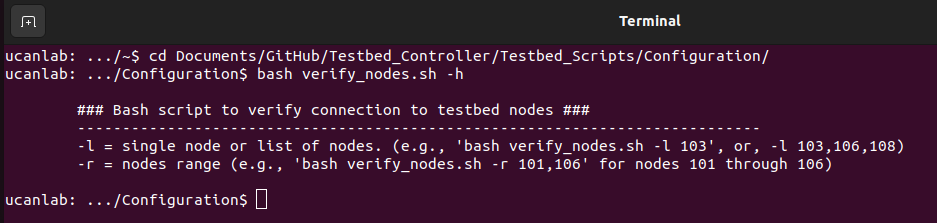

# Setting Up the Testbed Controller (TC)
## Overview
The TC is the primary device for configuring the testbed nodes, initiating tests, and aggregating data. We suggest using Ubuntu Linux as the OS for your TC (setup described below), but we also provide documentation for setting up your TC in a [Windows machine](https://github.com/UCaNLabUMB/Testbed_Controller/blob/main/Documentation/Setup_TC_Windows.md).

To describe the TC setup, we describe the following steps:
* Ubuntu Installation
* TC IP Assignment
* Testbed Code Setup
* _FUTURE_ GUI Setup

## Ubuntu Installation
We suggest installing Ubuntu OS rather than using a virtual machine. For current testing, we use Ubuntu version 22.04 LTS. To do this, follow the [Ubuntu Installation tutorial](https://ubuntu.com/tutorials/install-ubuntu-desktop#1-overview) for Ubuntu Desktop.

## IP Assignment
Once you have a computer with Ubuntu installed, you should assign a static IP address to the Ethernet interface that you will use to connect to the testbed control network. In Ubuntu 22.04, you can do this as follows:
* Go to Settings -> Network and click on the gear symbol next to the desired network interface.
* Select the "IP v4" tab and assign "IPv4 Method" to "Manual"
* Enter the TC's IP address as `10.1.1.1` with a Netmask of `255.255.255.0`
* Select Apply

**NOTE:** We will verify the TC network settings after setting up the RPi Nodes.

## Testbed Code Setup
While the testbed code can be directly downloaded from the Github repository, we suggest using GitHub Desktop to clone the testbed repository so that you can easily pull future updates into your local repository. Since Github Desktop is not officially supported by Github, it needs to be installed with the GDebi Package Installer. Follow these steps to install GitHub Desktop on Ubuntu:
* Open the "Ubuntu Software" and install _GDebi Package Installer_.
* Download the most recent GitHub desktop release as a .deb file from:
  - [https://github.com/shiftkey/desktop/releases/](https://github.com/shiftkey/desktop/releases/)
* Open GDebi Package Installer and install the downloaded .deb package
  - File -> Open and select the downloaded .deb file
  - Select "Install Package"
* Open GitHub Desktop and login to your Github account

Once you have GitHub Desktop installed/setup, you can clone the Testbed Repository to a local repository. After cloning the repository, you should find the following directories in the location where the local repository was created:
* `Documentation` where you can find descriptions of the setup procedure and the various scripts for configuration, testing, and analysis
* `GUI_Code` which is a MATLAB graphical user interface that helps interact with the testbed scripts in a more user-friendly format, and 
* `Testbed_Scripts` that contains two subfolders, Configuration and Test.
  - `Configuration`: Holds scripts to get general information about the nodes, verify connection between the Testbed Controller, APs, clients and servers, and check for the AP information.
  - `Test`: Contains scripts to run the testbed by initiating the server (server_start.sh) and the clients (client_start.sh), and to aggregate / parse collected data.

To verify that the TC is able to run the scripts, you can test by going to the `Testbed_Scripts/Configuration` directory in a terminal and running `bash verify_nodes.sh -h`. This should display help information about the first script that we will use after setting the RPi Nodes.

## Previous Chapter
[Testbed Architecture](https://github.com/UCaNLabUMB/Testbed_Controller/blob/main/Documentation/TB_Architecture.md)

## Next Chapter
[Setting Up RPi Nodes](https://github.com/UCaNLabUMB/Testbed_Controller/blob/main/Documentation/Setup_RPi_Node.md)