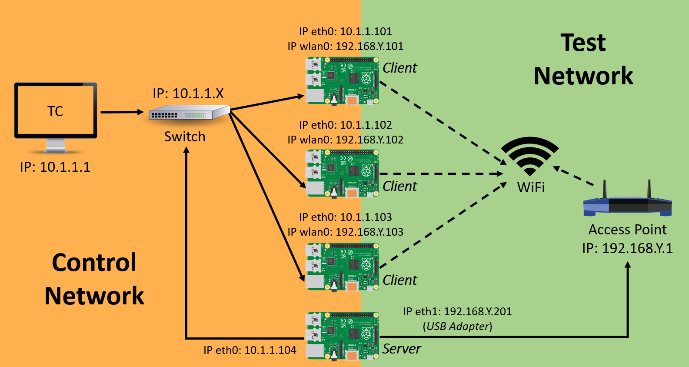

# Testbed Architecture

## Overview
The architecture includes a Control Network, which connects the Testbed Controller (TC) with all the RPi nodes, and a Test Network which connects the RPi nodes to access point(s) in the test environment. The RPi nodes run iperf tests to evaluate performance of the Test Network.

The base architecture for this testbed uses a wired Ethernet network to connect the TC and RPi nodes in order to implement the Control Network. The Test Network is formed by RPi nodes connected to one of the WiFi access points (APs) and enabled as either an iperf server or iperf client. Client nodes connect to the AP via WiFi. Server nodes are wired to the AP.

In this section, we will provide general information about the testbed structure, including:
* [Testbed Components](https://github.com/UCaNLabUMB/Testbed_Controller/blob/main/Documentation/TB_Architecture.md#testbed-components)
* [Network Conventions and Addresses](https://github.com/UCaNLabUMB/Testbed_Controller/blob/main/Documentation/TB_Architecture.md#network-conventions-and-addresses)
* [Software Tools](https://github.com/UCaNLabUMB/Testbed_Controller/blob/main/Documentation/TB_Architecture.md#software-tools)
* [Data Collection Procedure](https://github.com/UCaNLabUMB/Testbed_Controller/blob/main/Documentation/TB_Architecture.md#data-collection-procedure)

## Testbed Components
* **Testbed Controller (TC):** Centralized station (PC) that allows access and control to all nodes remotely via ssh across a dedicated control network.
* **RPi Nodes (Clients and Servers):** Raspberry Pi microcontrollers with iperf tool installed to test network performance for given configurations.
* **Access Points (APs):** COTS WiFi router(s) for testing network connectivity and performance analysis. 
* **Other Components:**
  - Pi Components (SSD Cards and Power Cables)
  - Ethernet Cables and USB to Ethernet Adapter(s)
  - Network Switch(es)
  - Monitor/Keyboad/Mouse is needed for setting up RPi Nodes

## Network Conventions and Addresses
The Control Network and Test network use a 10.1.1.X subnet and 192.168.Y.X subnet, respectively, where: 
* Y = AP number
* X = Device address (i.e., node number)
  - RPi node numbers should start with node 101.
  - It is helpful to physically label each RPi node with its node number.

Specific Addresses
* **TC:** `10.1.1.1`
* **APs:** `192.168.Y.1`
* **Server Nodes:** `10.1.1.X` / `192.168.Y.201` 
  - 192.168.Y.201 assigned to a USB to Eth adapter connected to the Yth AP
  - This address is assigned via DHCP reservation at the AP linked to the adapters MAC address
  - This allows different RPi nodes to be swapped out as the server
* **Client Nodes:** `10.1.1.X` / `192.168.Y.X`
  - X represents the pi's numbers staring at 101.
  - 192.168.Y.X is assigned to the node's WLAN via DHCP when connected to the Yth AP
  - This allows each node to switch between APs while maintaining the convention

**NOTE:** The nodes' Ethernet IPs (i.e., 10.1.1.X) are statically defined when setting up RPi nodes. Test network addresses are assigned via DHCP reservations to maintain convention when switching to a different AP.

## Software Tools
* **SSH:** We use the Secure Shell network protocol to communicate remotely from the TC to the RPi nodes for control and data exchange
* **IPerf3:** IPerf software works in a client-server mode. On server nodes, iperf will run in server mode and wait for traffic from the iperf client. On client nodes, iperf will run in client mode, generate traffic, and measure the maximum data transfer rate and the maximum network bandwidth (throughput). We use iperf3 as the primary testing tool for higher layer throughput analysis within the testbed.
* **GNURadio:** (Optional) The GNURadio software is a used for signal processing on the Raspberry Pis. While some default flowgraphs are already generated and ready to be deployed to the RPi nodes, installing GNURadio on the TC is necessary in order to create custom flowgraphs that can be deployed to the RPi nodes.

## Data Collection Procedure
Once the testbed is setup, data collection is implemented as follows. The steps below are defined in more detail in the [Testing and Analysis](https://github.com/UCaNLabUMB/Testbed_Controller/blob/main/Documentation/Testing.md) documentation.
* Configure nodes and test network connection (from TC)
* Start iperf server(s) at server nodes
* Run iperf tests at distributed client nodes
* Store resulting data on client nodes
* Transfer data to TC
* Analyze data on TC

## Next Chapter
[Setting Up the TC](https://github.com/UCaNLabUMB/Testbed_Controller/blob/main/Documentation/Setup_TC.md)
