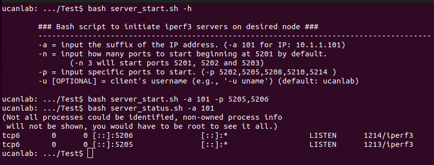

# Testing and Analysis
## Overview
Once the configuration process has been completed, the testbed can be used for testing performance (e.g., per-device and aggregate throughput) in a variety of dense-network configurations. This includes testing for different environments, device power configurations, number of connected devices, etc. In this documentation, we will highlight a baseline test for comparing throughput in an environment where 2 nodes are connected to a single environment. We will show the process for running a few tests, aggregating results at the TC, and visualizng the results. The scripts below are found in the `Test` directory.

In particular, we will discuss the following topics related to the general data collection and analysis procedure: 
* [Initiate iperf Servers](https://github.com/UCaNLabUMB/Testbed_Controller/blob/main/Documentation/Testing.md#initiate-iperf-servers)
* [Initiate iperf Clients](https://github.com/UCaNLabUMB/Testbed_Controller/blob/main/Documentation/Testing.md#initiate-iperf-clients)
* [Transfer Results to TC](https://github.com/UCaNLabUMB/Testbed_Controller/blob/main/Documentation/Testing.md#transfer-results-to-tc)
* [Parse Results](https://github.com/UCaNLabUMB/Testbed_Controller/blob/main/Documentation/Testing.md#parse-results)
* [Analyze Results](https://github.com/UCaNLabUMB/Testbed_Controller/blob/main/Documentation/Testing.md#analyze-results)
* Extended Analysis - Scripting More Complex Scenarios

## Initiate iperf Servers
The first step to any test scenario is to initialize the iperf servers running on server nodes. To enable multiple simultaneous iperf connections, we use a clear port distinction such that iperf servers are initiated for each client node with a server port corresponding to port 5100 + X where X is the node number (i.e., 5201, 5202, etc. for nodes 101, 102, etc.). We have setup a script, `server_start.sh`, to to initialize multiple servers on a specified server node. In addition, the `server_status.sh` script checks a server node and reports back the currently running servers, along with the port number and PID for the process(es). In the instance shown below, we start by showing the `server_start.sh` help menu and then starting 2 iperf servers on node 101. The `server_status.sh` script then shows that we have two active servers that are listening on ports 5205 and 5206. Note that the `server_status.sh` script also has an option to kill specific processes on the specified server node. This is intended for killing active iperf servers, but should only be used if you are comfortable with processes, PIDs, etc. If not, the easiest way to reset a server is to reboot the node.

* **NOTE:** It is a good idea to start the servers at different server nodes using separate terminals. This will allow you to see the raw results of iperf tests (from the servers' perspectives) when running tests below. If you use the same terminal to run the scripts below, the server data can be confusing when it is printed out to the terminal.

## Initiate iperf Clients
Once the servers have been initiated, we are ready to start collecting data. For this, we use the `client_start.sh` script. This script communicates with multiple client nodes and has them initiate iperf throughput tests. While the tests are not perfectly synchronized, each set of tests is started together and the latency from the start of the first test to the start of the last test is on the order of milliseconds (for a set of 10 nodes). Accordingly, the impact on performance results is negligible if the iperf tests are run for reasonable time durations. 

The images below demonstrate two simple instances of the `client_start.sh` script. In the first image, we first show the help menu for the `client_start.sh` script, and then run the script for two client nodes (nodes 105 and 106). The `-s` flag is used to indicate which server to connect to and the number specifies the number associated with the AP number for the server node of interest (i.e., Y in our testbed convention). In this case, both nodes are connecting to the server at `192.168.1.201`, but the flag can also be used with a comma separated list as input to indicate the server for each client on a node-by-node basis. The `-f` flag indicates the name for this specific experiment, and the folder where raw data will be stored on each of the client nodes. The `-t` and `-i` flags correspond to the iperf3 flags for time duration (in seconds) and interval reporting. The `-k` flag indicates how many repetitions of this test should be run.  In the first instance, we are running 4 repetitions of the test with each repetition running for 45 seconds. In the second image below, we repeat the test while only using node 105 as a client. We also repeated the test a third time with only node 105 operating as a client.

## Transfer Results to TC
The simplified design for our testbed initially stores test results locally on each of the RPi nodes. This means that the raw data results of the iperf tests will need to be transferred back to the TC for aggregation and analysis. Our `transfer.sh` script manages this, as shown in the image below. The script takes parameters for the set of nodes to collect data from (using either the `-l` or `-r` flag) and the folder name used when running the `client_start.sh` script. When the `transfer.sh` script is run, results from all specified nodes will be aggregated at the TC in a specific directory (`~/ucan_TB/TB_Results`). Each of the test results folders has subfolders for the data from each RPi node, and each subfolder has results files for each iteration of the test.

## Parse Results
While the full iperf results are stored in each of the individual text files, we also provide a simple `parse_data.sh` script to pull throughput results from the set of text files in a specified test directory and aggregate in a single CSV file. This is demonstrated below for the three tests described above. The instance shown here first gets the help information for the `parse_data.sh` script, then calls the script three times to parse the data stored in each of the directories above into unique text files. Notice that each line of the parsed file indicates a different client node's results, and the columns indicate the results for different iterations of the test. Here, we can see a simple outcome that demonstrates the per-node throughput dropping by approximately half when the two nodes are competing (compared to the results when each node is operating on its own).

## Analyze Results
_coming soon_

## Extended Analysis - Scripting More Complex Scenarios
_coming soon_

## Previous Chapter
[Test Network Configuration](https://github.com/UCaNLabUMB/Testbed_Controller/blob/main/Documentation/Config_Test_Net.md)