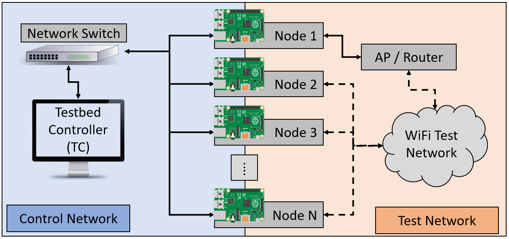

For Citation/Reference:

# Overview
This repository is developed and maintained by the Ubiquitous Communications and Networking Lab (UCaN Lab) at UMass Boston. The code provides a set of documentation and scripts for configuring distributed nodes from a central location, and offers experimental test capabilities for analyzing throughput in dense multi-access point and multi-user environments. Beyond this, the codebase includes functionality to extend the analysis to the signal level via software defined radio (SDR).

At the _network level_, this testbed framework is designed to analyze the impact of network configurations and traffic characteristics in a variety of scenarios. Rather than using real world devices with various internet based applications, device usage is emulated with Raspberry Pi (RPi) microcontrollers. All of the **RPi nodes** will be connected to a single computer acting as the **Testbed Controller (TC)**, allowing the network to be centrally configured and controlled. 

In order to extend analysis to the _signal level_, the testbed includes functionality to enable GNURadio signal processing flowgraphs on the RPi nodes. To interact with the physical environment, the framework is setup to utilize SDR hardware (e.g., universal software radio peripherals or **USRPs**) connected to the RPi nodes in order to generate custom waveforms and observe received signal characteristics. When implementing signal level analysis, the TC can deploy custom flowgraphs to the RPi nodes, remotely initiate the flowgraphs, modify parameters on running flowgraphs, and aggregate signal measurements from the set of nodes.

The baseline testbed architecture consists of a _Control Network_ and _Test Network(s)_ as shown below. The control network connects all RPi nodes to the TC. The Test Network(s) consist of WiFi router(s) that the RPi nodes can connect to. The iperf network performance analysis tool is used to generate traffic and analyze performance of the Test Network(s). RPi nodes on the Test Network(s) can be configured as iperf servers (connected to APs via Ethernet) or iperf clients (connected wirelessly to the APs).
 

# Directory Structure
This repository includes documentation that covers how to setup an instance of this testbed, scripts to perform the the testbed's core functionality, and a graphical user interface (GUI) to simplify the use of provided scripts. 
* The `Documentation` folder includes detailed information describing how to configure the TC/RPi nodes, execute performance analysis tests, and aggregate/analyze test results.   
* The `Testbed Scripts` folder contains the bash scripts that perform the core functionality of the TC. This folder includes three subfolders for the different categories of scripts, including:
  - `Configuration` scripts related to Test Network setup and Device Information.
  - `Test` scripts related to initializing iperf clients/servers and aggregating results.
  - `Analysis` scripts related to parsing and visualization of aggregated results.

# Equipment  
For the baseline version of the testbed, you will need the following equipment. Other variations of the testbed (to be described later) require supplemental equipment.
* Raspberry Pi microcontrollers (3B+, 4, or 5, ideally 4G RAM or higher)
  - microSD cards  
  - Power cables
* PC for Testbed Controller (Ideally, running Ubuntu Linux) 
* Networking Equipment
  - WiFi Router(s) 
  - Network Switches 
  - Ethernet cables
  - USB to Ethernet Adapter
* SDR Equipment (Optional)

# Chapters
| Chapter | Topic | Image | Summary 
| --- | --- | --- | --- |
|  0  | [Testbed Architecture](https://github.com/UCaNLabUMB/Testbed_Controller/blob/main/Documentation/TB_Architecture.md)              |  | Overview and Description of the testbed architecture and network conventions. 
|  1  | [Setting Up the TC](https://github.com/UCaNLabUMB/Testbed_Controller/blob/main/Documentation/Setup_TC.md)                        |               | Setup necessary software and network configuration settings for the TC to communicate with RPi Nodes and execute configuration / test commands.
|  2  | [Setting Up RPi Nodes](https://github.com/UCaNLabUMB/Testbed_Controller/blob/main/Documentation/Setup_RPi_Node.md)               |         | Setup necessary software and network configuration settings for the RPi Nodes to communicate with the TC. 
|  3  | [Control Network Configuration](https://github.com/UCaNLabUMB/Testbed_Controller/blob/main/Documentation/Config_Control_Net.md)  |      | Configure the control network to verify that IP conventions are correctly set and passwordless SSH is setup to interact with RPi nodes via testbed scripts.
|  4  | [Test Network Configuration](https://github.com/UCaNLabUMB/Testbed_Controller/blob/main/Documentation/Config_Test_Net.md)        |         | Configure the Test Network (i.e., wireless network connections, Tx power, etc.) via the TC.
|  5  | [Testing and Analysis](https://github.com/UCaNLabUMB/Testbed_Controller/blob/main/Documentation/Testing.md)                      | (ADD IMAGE)                                             | Initialize iperf server(s) and client(s) to initiate performance analysis tests, and aggregate/analyze results from the distributed RPi nodes.
